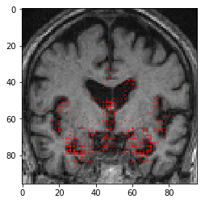
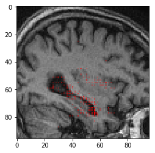
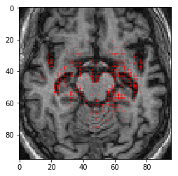
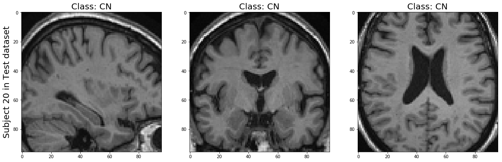
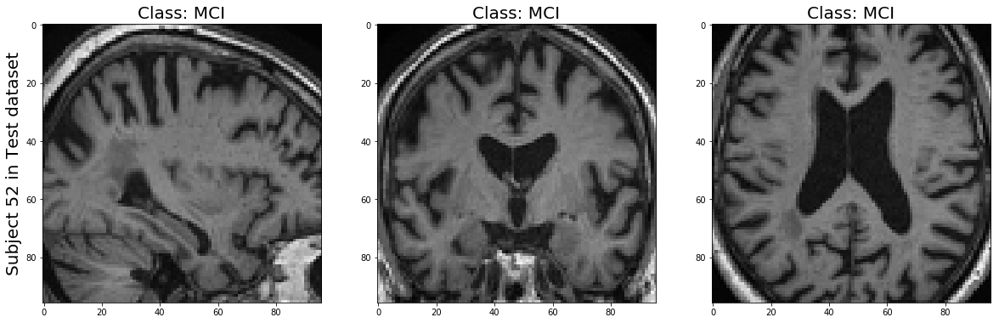
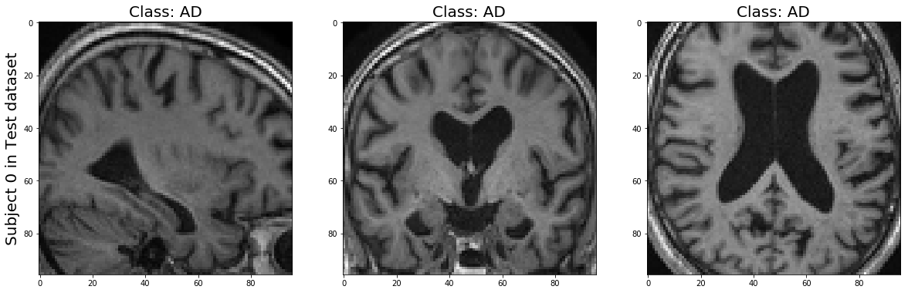

# On the design of convolutional neural networks for automatic detection of Alzheimer’s disease


## Introduction
In this project, we focus on how to design CNN for Alzheimer's detection. we provide evidence that 
* instance normalization outperforms batch normalization  
* early spatial downsampling negatively affects performance
* widening the model brings consistent gains while increasing the depth does not
* incorporating age information yields moderate improvement. 

Together, these insights yield an increment of approximately 14% in test accuracy over existing models.

This repository contains the code for the paper [On the design of convolutional neural networks for automatic detection of Alzheimer’s disease](https://arxiv.org/pdf/1911.03740.pdf). Author: Sheng Liu, Chhavi Yadav, Carlos Fernandez-Granda, Narges Razavian.
<p float="left" align="center">
 
 
 
</p>

## Prerequisites
- Python 3.6
- PyTorch 0.4
- torchvision
- progress
- matplotlib
- numpy
- visdom

## License
This repository is licensed under the terms of the GNU AGPLv3 license.

## Download ADNI data
1. Request approval and register at [ADNI website](http://adni.loni.usc.edu/data-samples/access-data/)
2. Download both the scans and the clinical data. From the main page click on `PROJECTS` and `ADNI`. To download the imaging data, click on `Download` and choose `Image collections`. In the `Advanced search` tab, untick `ADNI 3` and tick `MRI` to download all the MR images.
3. In the `Advanced search results` tab, click Select `All` and `Add To Collection`. Finally, in the `Data Collection` tab, select the collection you just created, tick `All` and click on `Advanced download`. We advise you to group files as 10 zip files. To download the clinical data, click on `Download` and choose `Study Data`. Select all the csv files which are present in `ALL` by ticking Select `ALL `tabular data and click Download.

## Data Preprocessing
Data Preprocessing with Clinica:
1. **Convert data into BIDS format**: please read the docs on [Clinica website](http://www.clinica.run/doc/DatabasesToBIDS/#adni-to-bids), and install required softwares and download the required clinical files. Note that we first preprocess the training set to generate the template and use the template to preprocess validation and test set. You can find the [link](https://drive.google.com/file/d/1KurgyjQP-KReEO0gf31xxjwE5R-xuSRB/view?usp=sharing) to download the template we used for data preprocessing. You can find the script we use to run the converter at /datasets/files:
```
run_convert.sh
```

2. **preprocess converted and splitted data**: you can refer our scripts at /datasets/files. For training data, refer:
```
run_adni_preprocess.sh
```
For val and test refer:
```
run_adni_preprocess_val.sh
```
and 
```
run_adni_preprocess_test.sh
```

## Examples in the preprocessed dataset
Here are some examples of scans for each categories in our test dataset:

<p align="center">
 
 
 
</p>

## Neural Network Training
Train the network ADNI dataset:

```
python main.py
```

You can create your own config files and add a **--config** flag to indicate the name of your config files.

## Model Evaluation
We provide the evaluation code in **Model_eval.ipynb**, where you can load and evaluate our trained model. The trained best model (with widening factor 8 and adding age) can be found [here](https://drive.google.com/file/d/1zU21Kin9kXg_qmj7w_u5dGOjXf1D5fa7/view?usp=sharing). 


## Results
<center>

| Method             | Acc.        | Balanced Acc. | Micro-AUC  | Macro-AUC |
| ----------------- | ----------- | ----------- | -----------  | ----------- | 
| ResNet-18 3D    | 52.4%      | 53.1%           | -           | -           |
| AlexNet 3D      | 57.2%      | 56.2%           | 75.1%       | 74.2%       |
| X 1             | 56.4%      | 54.8%           | 74.2%       | 75.6%       |
| X 2             | 58.4%      | 57.8%           | 77.2%       | 76.6%       |
| X 4             | 63.2%      | 63.3%           | 80.5%       | 77.0%       |
| X 8             | 66.9%      | 67.9%           | 82.0%       | 78.5%       |
| **X 8 + age**       | 68.2%      | 70.0%           | 82.0%       | 80.0%       |

</center>

## References
- Sheng Liu, Chhavi Yadav, Carlos Fernandez-Granda, Narges Razavian. "On the design of convolutional neural networks for automatic detection of Alzheimer’s disease", in NeurIPS ML4H, 2019.
